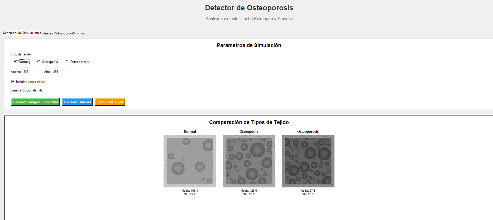
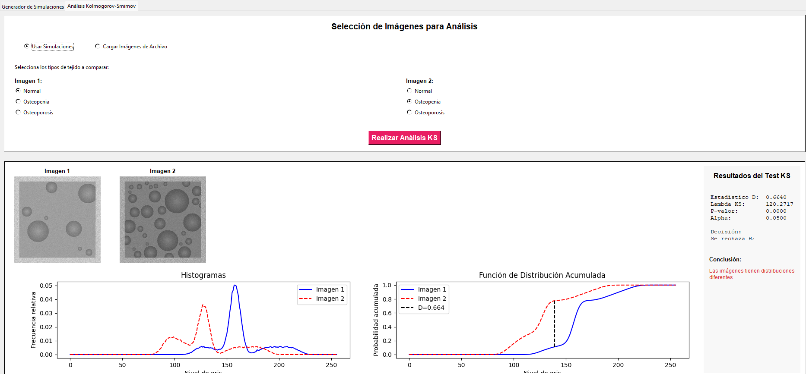

# 🦴 KS4BONES
## Detector de Osteoporosis - Análisis Kolmogorov-Smirnov

Este proyecto implementa un sistema visual interactivo en Python que permite analizar imágenes simuladas de tejido óseo y compararlas mediante el test estadístico de **Kolmogorov-Smirnov (KS)**. Utiliza una interfaz amigable desarrollada en Tkinter y algoritmos personalizados para generación de tejidos e interpretación de similitudes estadísticas.

### Comparacion de Dataset


### Análisis Kolmogorov-Smirnov


---

## ⚙️ Instalación

Sigue estos pasos para configurar el entorno y ejecutar la aplicación:

### 1. Clona el repositorio

```bash
git clone https://github.com/MauricioSalinas04/KS4BONES.git
cd KS4BONES
```

### 2. Crea un entorno virtual

```bash
python -m venv venv
.\venv\Scripts\activate     # En Windows
source venv/bin/activate    # macOS/Linux
```

### 3. Instala las dependencias

```bash
pip install -r requirements.txt
```

Contenido del `requirements.txt`:

```
numpy>=1.20.0
opencv-python>=4.5.0
Pillow>=8.0.0
matplotlib>=3.4.0
tk>=0.1.0
psutil==7.0.0
pyinstaller==6.13.0
```

---

## 🚀 Ejecución

```bash
python .\src\ui.py
```

O bien, compílalo como ejecutable (opcional):

```bash
pyinstaller --onefile --icon=icono.ico --name=KS4BONES .\src\ui.py
```

Esto generará el archivo ejecutable en `dist/KS4BONES.exe` (o equivalente en tu sistema operativo).

---

## 📁 Estructura del Proyecto

```
📦 KS4BONES
├── 📁 src/
│   ├── generadorTejidos.py    # Generador de tejidos óseos
│   ├── ks.py                  # Implementación test KS
│   └── ui.py                  # Interfaz gráfica
│
├── 📁 tests/
│   ├── pruebasUnitarias.py    # Tests unitarios
│   ├── pruebasIntegracion.py  # Tests de integración
│   ├── pruebaRendimiento.py   # Tests de rendimiento
│   └── benchmark.py           # Benchmarks del sistema
│
├── 📁 docs/
│   ├── demidenko2004.pdf      # Articulo "Kolmogorov-Smirnov Test for Image Comparison"
│   ├── ManualTecnico.pdf      # Documentación técnica
│   ├── ManualUsuario.pdf      # Documentación para usuario
│
│
├── 📁 dist/                   # Distribución compilada
│   └── KS4BONES.exe            # Generado despues del proceso con pyinstaller
│
├── requirements.txt           # Dependencias
└── README.md                 # Documentación principal
```

---

## 💡 Créditos

Proyecto desarrollado por Mauricio Salinas como parte de un estudio técnico de análisis estadístico aplicado a imágenes biomédicas.

👨‍🏫 Eugene Demidenko - Kolmogorov-Smirnov Test for Image Comparison

---

## 📬 Contacto
 
📧 Email: nicolascantu23@gmail.com  
🐙 GitHub: [Mauricio Salinas](https://github.com/MauricioSalinas04)
